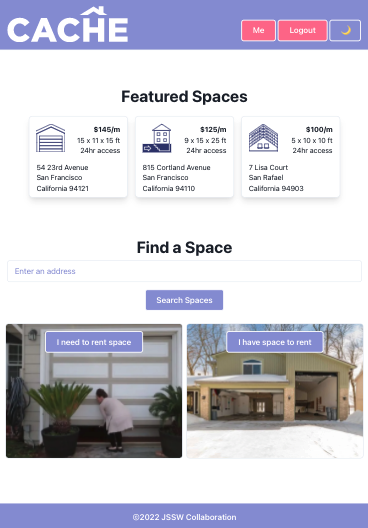

  

<h3 align="center">Cache</h3>

  

    Peer-to-peer local self-storage
     
  

     

  
Table of Contents

   <ol>
    <li>
      <a href="#about-the-project">About The Project</a>
      <ul>
        <li><a href="#built-with">Built With</a></li>
      </ul>
    </li>
    <li>
      <a href="#getting-started">Getting Started</a>
      <ul>
        <li><a href="#prerequisites">Prerequisites</a></li>
        <li><a href="#installation">Installation</a></li>
      </ul>
    </li>
    <li><a href="#roadmap">Roadmap</a></li>
    <li><a href="#contributing">Contributing</a></li>
    <li><a href="#license">License</a></li>
    <li><a href="#contact">Contact</a></li>
    <li><a href="#acknowledgments">Acknowledgments</a></li>
  </ol>

## About The Project

Cache is an app for finding and offering short-term local self-storage. Cache allows users to search for available garages, sheds, basements and attics in their vicinity. Neighbors with free space can offer to host storage to their community. 

(<a href="#top">back to top</a>)

### Built With

* [Node.js](https://nodejs.org/)
* [React.js](https://reactjs.org/)
* [MongoDB](https://www.mongodb.com/)
* [Express](https://expressjs.com/)
* [GraphQL](https://graphql.org/)
* [Apollo](https://www.apollographql.com/)
* [React](https://reactjs.org/)
* [Chakra UI](https://chakra-ui.com/)
* [Google Maps](https://developers.google.com/maps)
* [jsonwebtoken](https://www.npmjs.com/package/jsonwebtoken)
* [Nodemailer](https://nodemailer.com/)
* [bcrypt](https://www.npmjs.com/package/bcrypt)
* [mongoose](https://www.npmjs.com/package/mongoose)

(<a href="#top">back to top</a>)

## Getting Started

To get a local copy up and running follow these simple example steps.

### Prerequisites
1. Acquire a Google Maps API key
2. Acquire a React API key

### Installation

1. Clone the repo
2. Install client side NPM packages at /client
    `npm install`
3. Install server side NPM packages at /server
    `npm install`
4. Run `npm install` at project root
5. Enter your API keys in `.env`

(<a href="#top">back to top</a>)

## Contributing

Contributions are what make the open source community such an amazing place to learn, inspire, and create. Any contributions you make are **greatly appreciated**.

If you have a suggestion that would make this better, please fork the repo and create a pull request. You can also simply open an issue with the tag "enhancement".
Don't forget to give the project a star! Thanks again!

1. Fork the Project
2. Create your Feature Branch (`git checkout -b feature/AmazingFeature`)
3. Commit your Changes (`git commit -m 'Add some AmazingFeature'`)
4. Push to the Branch (`git push origin feature/AmazingFeature`)
5. Open a Pull Request

(<a href="#top">back to top</a>)

## License

Distributed under the MIT License. See `LICENSE.txt` for more information.

(<a href="#top">back to top</a>)

## Contact

* JSSW Collaboration - nearby.cache@gmail.com
* App Link: [https://cache-project.herokuapp.com/](https://cache-project.herokuapp.com/)
* Repo Link: [https://github.com/sivanagar/garage-finder](https://github.com/sivanagar/garage-finder)

(<a href="#top">back to top</a>)

## Acknowledgments

* joseduardo15062005 - [https://github.com/joseduardo15062005](https://github.com/joseduardo15062005)
* sivanagar - [https://github.com/sivanagar](https://github.com/sivanagar)
* HoolSeanalan - [https://github.com/HoolSeanalan](https://github.com/HoolSeanalan)
* wendyqnguyen - [https://github.com/wendyqnguyen](https://github.com/wendyqnguyen)

(<a href="#top">back to top</a>)

